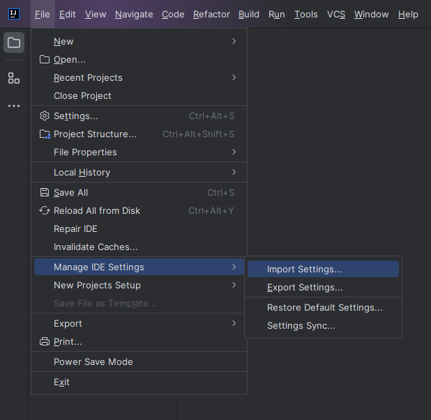
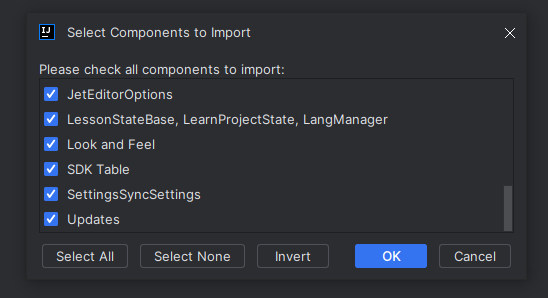
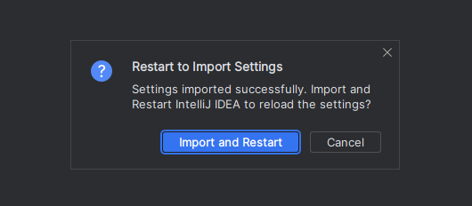
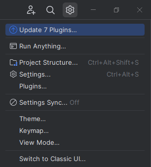
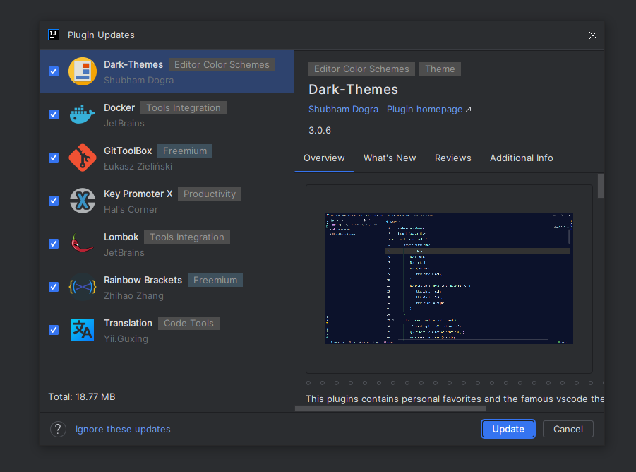

# IntelliJ Idea

`Open IntelliJ Idea`

`File -> Manage IDE Settings -> Import Settings...`

`Choose your file.zip`

`Select the components you want (all)`

`Import and restart the IDE`

`Select the Update plugins option`

`Select the plugins you want (all)`

Restart your IDE and you are ready to code!!!